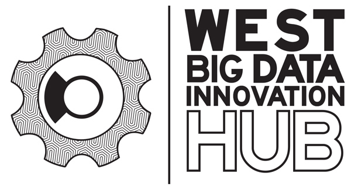

# Data science training and collaboration workshop, September 16th - 17th, 2019

## [HSI STEM HUB](https://hsistemhub.org/) + [WEST BIG DATA INNOVATION HUB](https://westbigdatahub.org/)

This two-day workshop will introduce participants to best practices in teaching
data science to students and researchers.

**Target audience**: STEM Faculty and Researchers at HSIs who would like to
incorporate data science into their curriculum

## Goals of the workshop:

#. Participants will learn new ways that data science can be integrated
into their curriculum.

#. Participants will use techniques and tools for teaching data science.

#. Participants will workshop and gain experience in teaching using approaches such
as live coding, use of computational notebooks, version control, etc.

#. Participants will learn about applications of data science in community
engagement (e.g., Data Science for Social Good).

#. Participants will incorporate ethics considerations into use of data science
tools and methods.

#. Participants will collaboratively develop concepts for further joint work.

## Tentative schedule:

### Day 1:

What is data science? (Speaker TBD)
Data Science for Social Good + ethical considerations (Anissa Tanweer)
Using the cloud for teaching and research (Amanda Tan)

### Day 2:

Teaching how to program with live coding (Ariel Rokem)
Building a community around data science (Kate Hertweck)
Working with public sector partners and stakeholders (Jose Hernandez)

## Registration:

To register, visit [eventbrite](XXX)

## Logistics:

Participants will receive: Lodging at University Inn for check in September 15,
check out September 17. Reimbursement for economy airfare, meals, transportation
to/from airport and workshop For those wishing, airfare can be arranged direct,
to reduce out of pocket costs

